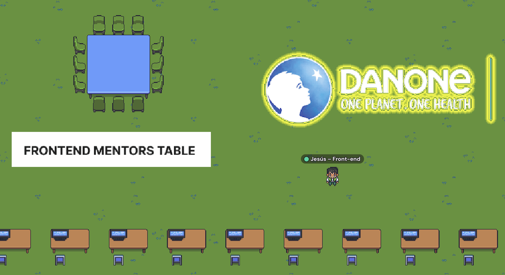
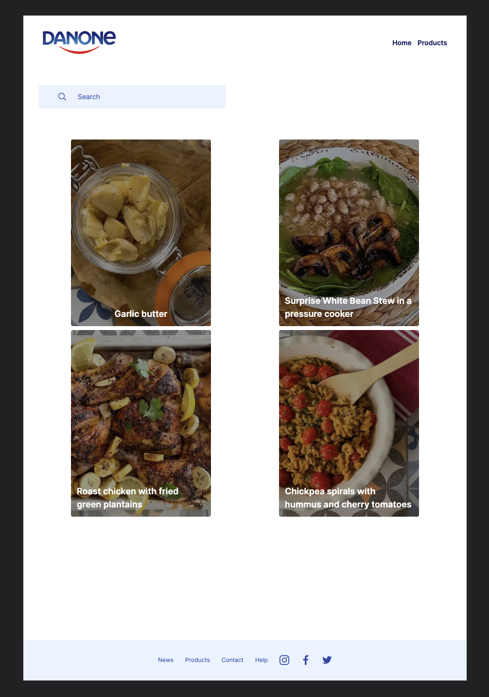
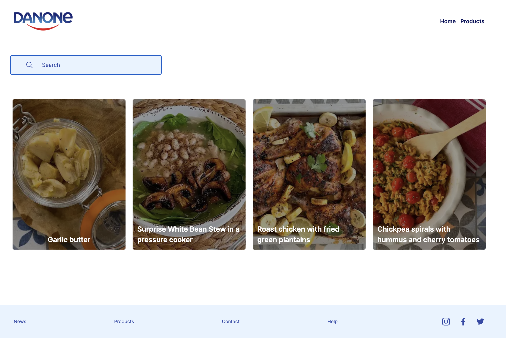
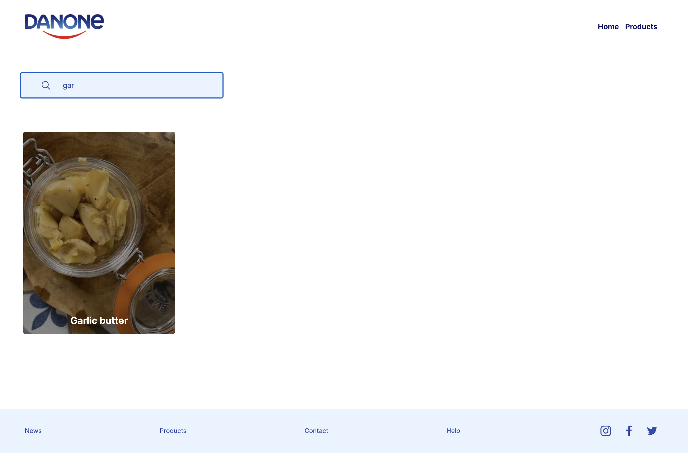
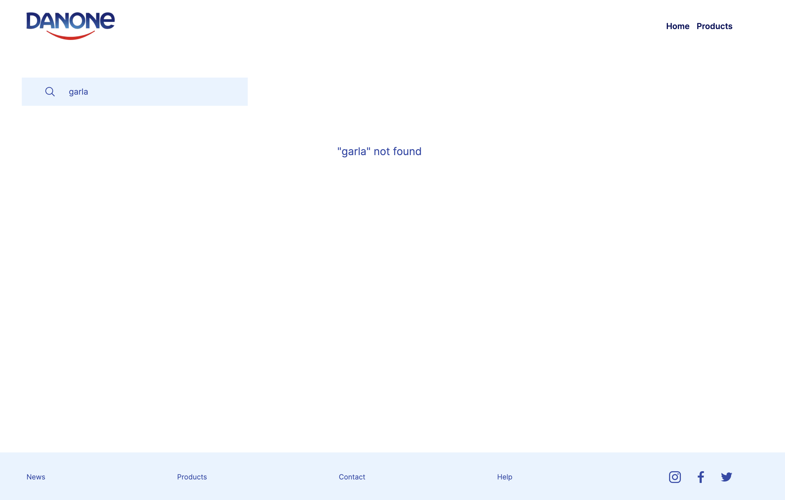
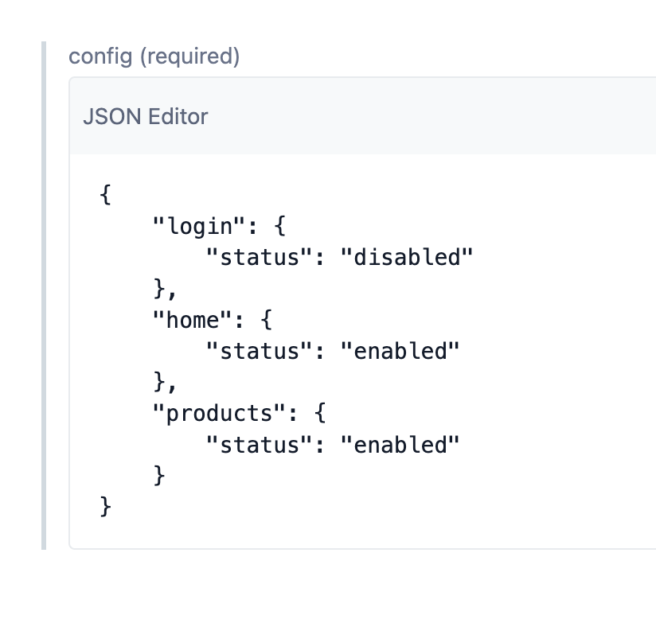
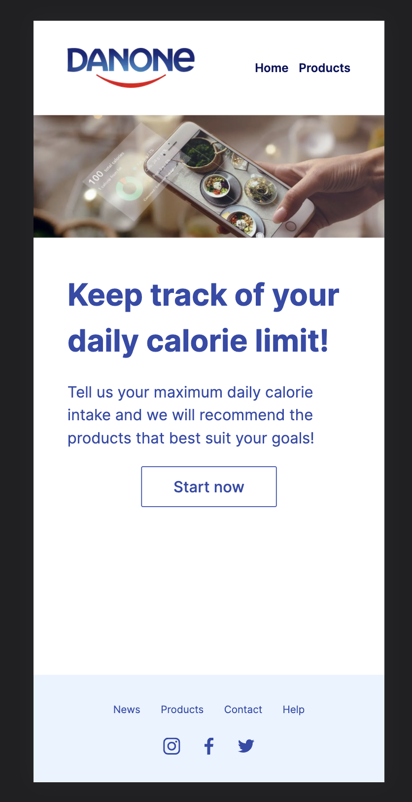
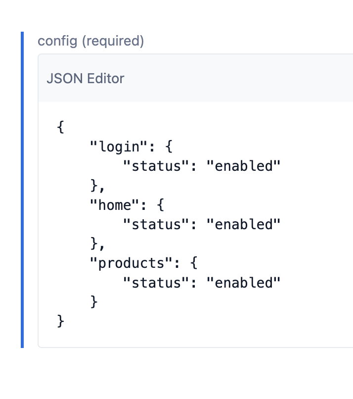
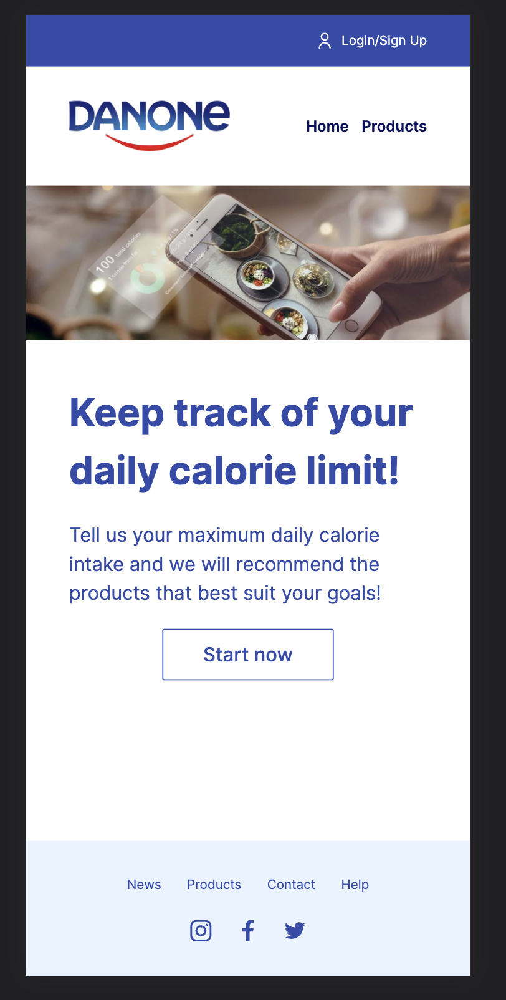

# Hackaton Danone México con NUWE :trophy:



## Proyecto :books:
- Cree una página de inicio de Danone Eco intuitiva y bien diseñada.
- Usa Headless CMS como administrador de contenido. [Recomendación: Contentful].
- Cree la API de GraphQL para conectarse con Headless CMS.
- Crear la documentación del proyecto.
- Implemente en aplicaciones como Vercel.

## Primeros pasos :rocket:
Para ayudar al desarrollo de esta aplicación o probarla, se tiene que cumplir estos pasos:
- Clonar el repositorio en tu máquina local.
    ```
    git clone https://github.com/jesusmarzor/hackaton-danone-mexico.git
    ```
- Instalar todas las dependencias del proyecto.
    ```
    npm install
    ```

- Iniciar el servidor de desarrollo en tu máquina local.
    ```
    npm run dev
    ```

## Resultado final :star:






## Detalles Técnicos 📋
Este proyecto se ha desarrollado en Typescript con Nextjs 13, GraphQL y Contentful. También ha sido necesario añadir estas librerías:
- eslint
- i18n
- tailwindcss

Se ha pensado más en el "road map técnico" que en el "pixel perfect" ya que no se tenían muy claro los diseños. Detalles a tener en cuenta:

- Se ha preparado la aplicación para añadirle diferentes idiomas.

- Se ha creado un "ModulesController" que se recibe desde back para habilitar o deshabilitar modulos en la aplicación en caliente. Por ejemplo:

    

    

    Podemos observar que desde back nos llegan 3 módulos y el único que está "deshabilitado" es el login porque no ha dado tiempo a terminar su desarrollo y queremos que al usuario no se le muestre en la cabecera este acceso.

    

    


    En un futuro cuando se termine el desarrollo, si queremos mostrar el acceso al login desde la cabecera solo habría que mandar desde el back ese módulo habilitado y se habilitará en el frontal como se ve en la captura anterior.

## Detalles Personales 📋
Está hackaton me ha servido para apender los cambios que ha dado Nextjs en su versión 13 (me ha costado adaptarme :dizzy_face:) y sobretodo para aprender GraphQL y Contentful.

Es una pena que haya durado tan poco y no pueda terminar todas las páginas de la web como me gustaría.

Muchas gracias a NUWE y Danone México por celebrar estos eventos tan divertidos :smile:.

## Mejoras futuras :point_up:
- Tests unitarios.
- Refactorizar la importación de iconos.
- Llevar el ".json" de la configuración del lenguaje al back para poder cambiar las labels en caliente.

## Autor ✒️
Jesús Martín Zorrilla - Proyecto y documentación
- [Portafolio](https://jesusmarzor.vercel.app)
- [Linkedin](https://linkedin.com/in/jesusmarzor)

## Licencia 📄
Este proyecto está bajo la Licencia (GNU General Public License v3.0) - mirar el archivo [LICENSE](LICENSE) para más detalles.